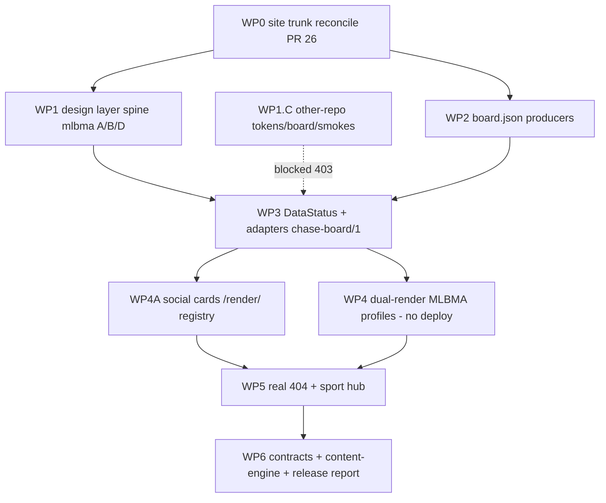

# Chase Analytics cross-sport programme — living checklist

**Handoff date:** 2026-09-08  
**This repo:** `Alphakiller1/mlbma-pipeline`  
**Do not merge to `master` as a release.** WP0 PR #26 is draft. WP1 stacks on #26 (`cursor/reconcile-branch-to-master-4ee4`).  
**Palette:** settled. Do **not** change hex values. Do **not** restyle pages. Do **not** deploy production. MLB-model contracts reconciled locally (WP6; origin 403).

**Status vocabulary:** `done` · `in-progress` · `blocked` · `not started` · `N/A`  
**Evidence:** PR, commit, file, test, URL, or explicit gap.

**Owner-repo key:** `mlbma` = this repo; `mlb-model`; `nfl-model`; `wnba-edge-model`; `cfb-model`; `chase-content-engine`; `pages/cloudflare` = live hosting (out of this agent’s write scope for other repos).

---

## Order of work (gate diagram)



**Hard gates:** WP1 (token spine) **before** WP3 (adapters consume tokens + DataStatus). WP4A **before** WP5 (registry URL-only + `/render/` 301s before hub/404). WP1.C does **not** block mlbma WP1 A/B/D.

---

## Out of scope (do not do)

| ID | Item | Status | Evidence |
|----|------|--------|----------|
| OOS-1 | Production deploy of chase-analytics.com | N/A | No push to `master`; no Pages production trigger |
| OOS-2 | Merge WP0/WP1 as a release | N/A | PR #26 draft; WP1 must not merge until programme says |
| OOS-3 | Change Cloudflare/GitHub cloud settings | N/A | Docs only |
| OOS-4 | Paid odds / `--fetch-odds` | N/A | WP2 patches preserve no extra Odds API |
| OOS-5 | Model formula / Tile.priced / GEM_EDGE_PTS / GEM_STATES changes | N/A | Preserve `authority` / `may_bet` / `unmet_gates` |
| OOS-6 | Import SCL theme / SCL CSS | N/A | Chase palette only |
| OOS-7 | Restyle pass / pixel redesign | N/A | Tokens/tests/docs; pixel-identical where already compliant |
| OOS-8 | Change hex palette values | N/A | Seed sha256 `13014f566ee570d283b12859a6578d12d179a4cc39aecf8845518700fb85e911` |
| OOS-9 | Push mlb-model / nfl-model / wnba-edge-model / cfb-model / chase-content-engine | blocked | `cursor[bot]` 403 (retried 2026-09-08) |
| OOS-10 | Resolve mlb-model three contradictory contracts | **done** (local; origin 403) | WP6 kits in `docs/wp6-patches/mlb/` |
| OOS-11 | `push_*.py` changes in WP4A | N/A | Explicitly forbidden |

---

## PART 1 — Defects (handoff inventory)

| ID | Item | Owner | Status | Evidence | Leftover risk |
|----|------|-------|--------|----------|----------------|
| D-01 | `LIVE_SITE_SETUP.md` wrong production branch/output dir | mlbma | **done** (WP0) | `docs/LIVE_SITE_SETUP.md`: production `master`; whole-repo rsync; destination `/`; not `dashboard` | Live CF project settings still need a human glance; this PR does not PATCH Pages |
| D-02 | `ECOSYSTEM.md` §5 ghost files (`matchup_hub.js`, `rl_tab_uix.js`, `mlbma_signals.js`) | mlbma | **done** (WP0) | `docs/ECOSYSTEM.md` §5/§6/§9/§11 cleaned; `docs/RECONCILE_WP0.md` | Doc last-reviewed date still 2026-05-22 |
| D-03 | `dashboard/_redirects` inert vs root `_redirects` | mlbma | **done** (WP0) | Root `_redirects` is the contract; `dashboard/_redirects` comment/inert | Redirects only take effect after a **root** Pages deploy (see WP0-R7) |
| D-04 | Root relative redirect loop trap (§1.3) | mlbma | **done** (WP0) | Root `index.html` uses **absolute** `/dashboard/index.html` | Nested relative `index.html` under a 200 SPA fallback can still loop if someone reintroduces it |
| D-05 | Real 404 page still missing | mlbma | **done** (this PR) | Root `404.html` + Cloudflare Pages 404 | Catch-all 200 stub must stay gone; verify after Pages deploy |
| D-06 | Home page dual definition (`dashboard/index.html` vs OEM vs root) | mlbma | **done** (WP0) | Feature 8770-line `dashboard/index.html`; OEM stub → `index.html`; root absolute redirect | Nav still points at OEM filename (WP0-R4) |
| D-07 | ~45-file / ~52-overlap conflict log | mlbma | **done** (WP0) | `docs/RECONCILE_WP0.md` (~29 content conflicts + auto-merge list) | Auto-merged files were not hand-reviewed line-by-line |
| D-08 | 62 uncommitted files on **other machine** not on origin (`card_matchup.html`, `card_market_map.html`, `card_compose.html?`, `outputs/render_social_cards.py`, `dashboard/index.html` WIP, `team_rankings.html` WIP, `matchup_shared.js` WIP, …) | mlbma + human | **blocked** UNRECOVERED | Hunt 2026-09-08: remotes, stash, reflog, worktrees, `/tmp`, GitHub filename search — `docs/UNRECOVERED_WIP.md`. `card_compose.html` is committed; matchup/market_map/`render_social_cards.py` still missing | **Must recover from that machine.** Silent loss if that disk is wiped |
| D-09 | `pages.yml` smoke URL `scope=team&team=NYY` | mlbma | **done** (WP0) | `.github/workflows/pages.yml` uses `family=scoring&hand=r&window=L30&loc=home` | `dashboard_runtime_diag.py` still LineupView-only (WP0-R6) |
| D-10 | `Last_Updated` triple fetch + `chase_nav` clock fallback | mlbma | **in-progress** | `chase_nav.js` no longer paints `formatClock()` on failure (renders `unknown` + stale). `ChaseDataStatus` exists. Index/`mlbma_ui.js` still have their own parsers | Unify remaining fetchers onto `ChaseDataStatus` |
| D-11 | Token precedence differs per page | mlbma | **done** (WP1) | Shared TIER 1+2; inline palettes removed on index/rankings/glossary | Mockup page still has local `:root` (allowlisted) |
| D-12 | Inline `:root` in `index.html` + `team_rankings.html` | mlbma | **done** (WP1.A3) | Deleted | Print `:root` on index remains |
| D-13 | `lineup_view.js` hardcoded `var(...,#hex)` fallbacks | mlbma | **done** (WP1.A3) | `lineup_view.js` | One leftover `#E8DCFF` on active family desc (not a var fallback) |
| D-14 | `?v=` stamp drift on design-layer files | mlbma | **done** (WP1.A5) | `20260908a` on chase-tokens / design_system / theme / `design_layer_version.js` | Other assets still have their own stamps |
| D-15 | CFB Tuesday cron vs Saturday week end | cfb-model | **blocked** (WP2 local) | Patch `docs/wp2-patches/cfb/0001-Rebuild-the-board-Sunday-and-Monday-without-extra-Od.patch`; local branch `cursor/cfb-sunday-cron-4ee4` | Not on origin (403). Week-end rebuild still wrong in production until applied |
| D-16 | WNBA no cron / no `board.json` | wnba-edge-model | **blocked** (WP2 local) | Patch `docs/wp2-patches/wnba/0001-Publish-board.json-build.json-and-record.json-from-c.patch`; samples `/tmp/wnba-sample2/{board,build,record}.json` | Production still HTML-only |
| D-17 | MLB no `board.json` | mlb-model | **blocked** (WP2 local) | Patch `docs/wp2-patches/mlb/0001-Export-a-slate-JSON-bundle-beside-the-Pages-HTML.patch`; schema `mlb-model/board/1` | Hub cannot `fetch` a contract until owner deploys |
| D-18 | NFL board 5-day stale | nfl-model + mlbma WP3 | **not started** (view-time) | Producer already emits board; **freshness at view time = WP3 DataStatus**, not a producer patch | Do not “fix” by refetching odds |
| D-19 | No JS date logic on model pages | models | **not started** | WP3 adapters; model pages stay data-driven | Clock-in-JS would lie across TZ |
| D-20 | Contrast / group opacity NFL tiles | nfl-model + tests | **in-progress** (WP1.B7 measures; **do not port** in WP3/4) | Seed: on `#12141D`, `#6E7383`=3.89 (fail body text), `#4C5161`=2.32 fail, `#A4A8B6`=7.74 metadata floor; 50% opacity composites ~2.85 and ~1.89 | WP3/4 must not copy NFL group-opacity for informative regions |
| D-21 | `board.css` four-way fork + self-blessing `BOARD_CONTRACT.sha256` | four models | **done** (local; origin 403) | Header/tests now say tokens shared, board.css sport-specific; kits `docs/wp1-c-patches/` | Not on origin until owner `git am` |
| D-22 | mlb-model three contradictory contracts | mlb-model | **done** (local; origin 403) | V2-DESK Current; v1 + redesign Superseded; `docs/DESIGN_INDEX.md` | Not on origin |
| D-23 | `chase-content-engine` uncommitted tree + remaining renderer defects | chase-content-engine | **done** (local; origin 403) | Origin was clean; renderer fixes on `cursor/content-engine-renderer-4ee4`; kit `docs/wp6-patches/chase-content-engine/` | Not on origin |
| D-24 | `wnba-edge-model/site` Next.js ignore | wnba-edge-model | **not started** | WP5/WP6 IA | Next app must not be treated as the public board |
| D-25 | Structure lock §3.2/§3.3 carve-out not written | mlbma | **done** (WP1.D12) | contract §3.2.1 dated 2026-09-08 | Do not over-read as lineup DOM rewrite |

---

## WP0 — Site trunk reconcile (PR #26)

Handoff numbered 1–7 plus leftover risks from the WP0 agent.

| ID | Item | Owner | Status | Evidence | Leftover risk |
|----|------|-------|--------|----------|----------------|
| WP0-1 | Merge-base reconcile `master` ← `batter-profile-prop-rework` | mlbma | **done** | Branch `cursor/reconcile-branch-to-master-4ee4`; PR [#26](https://github.com/Alphakiller1/mlbma-pipeline/pull/26) draft; HEAD at branch creation `286c69e` | Master moved during work (`#25` backport); conflict set ≠ original “45 files” brief |
| WP0-2 | Home = feature `dashboard/index.html` (8770-line) | mlbma | **done** | `docs/RECONCILE_WP0.md` Home-page decision table | Dual paint until OEM nav links die |
| WP0-3 | OEM stub `chase_analytics_mlb_oem_v7.html` → `index.html` | mlbma | **done** | Stub file + root `_redirects` 301s | Bookmarks still hit stub (extra hop) |
| WP0-4 | Root `index.html` absolute `/dashboard/index.html` | mlbma | **done** | `/workspace/index.html` | Relative trap if rewritten |
| WP0-5 | `_redirects` at deploy root | mlbma | **done** | `/workspace/_redirects` | Ineffective until production deploy (WP0-R7) |
| WP0-6 | Docs: LIVE_SITE_SETUP, ECOSYSTEM ghosts, pages.yml smoke | mlbma | **done** | See D-01, D-02, D-09 | — |
| WP0-7 | Preserve master slate identity (`matchup_shared.js`, TBD, `gamePk`) | mlbma | **done** | `docs/RECONCILE_WP0.md`; post-merge patches on `index.html` / `matchup_compare.js` / `tests/test_publish_contract.py` | Feature CDF PitchScore not present |

### WP0 leftover risks (must stay visible)

| ID | Item | Owner | Status | Evidence | Leftover risk |
|----|------|-------|--------|----------|----------------|
| WP0-R1 | Feature PitchScore CDF / wx limiter **not ported** | mlbma | **not started** | `matchup_shared.js` kept master WHIP-pool PitchScore | Feature `psNormCdf` / `PS_ANCHORS` / wx concurrency absent |
| WP0-R2 | Rotowire multi-view picker **not ported** | mlbma | **not started** | `scrapers/scrape_lineups.py` master dual-URL + API | Stale Rotowire HTML views may still miss |
| WP0-R3 | Python slate API rollover vs client published-day + 17:00 fallback | mlbma | **not started** | `core/slate_date.py` = API; `matchup_shared.js` = published `Slate_Date_ET` + 17:00 | Client and pipeline can disagree around rollover |
| WP0-R4 | Nav still points at OEM filename | mlbma | **done** (this PR) | `dashboard/chase_nav.html` → `index.html`; `integrate_chase_nav.py` | OEM 301s remain for bookmarks |
| WP0-R5 | `wrangler.toml` from feature vs upload exclude | mlbma | **done**/doc | `docs/LIVE_SITE_SETUP.md` says toml/jsonc excluded; `cloudflare-deploy.yml` excludes `wrangler.jsonc` **only** (not `wrangler.toml`) | `wrangler.toml` may still rsync into `_site` — verify exclude |
| WP0-R6 | `dashboard_runtime_diag.py` times out on **home** (script only knows LineupView) | mlbma | **not started** | CI smokes `team_rankings.html?...` not `index.html` | Home regressions undetected |
| WP0-R7 | Redirects only after root Pages deploy | pages | **not started** | No production deploy this programme | Live site still old redirects until merge+deploy |
| WP0-R8 | PR #26 **draft**, do not merge | mlbma | **done** (process) | `gh pr view 26` → `isDraft: true`, base `master` | Accidental merge = live deploy |
| WP0-R9 | Tests at WP0 close | mlbma | **done** (WP0 report) | 26 unittest OK after contract patches; team_rankings 14/14; home Playwright 0 pageerrors (WP0 agent) | Re-run after WP1; home diag still not in CI |

---

## WP1 — Design layer spine

**Constraint:** vanilla, no bundler, no restyle. Screenshots at **375** and **1440** of `index`, `team_rankings`, `team_profile`. Do not change hex. Do not resolve D-22.

### A. Three token tiers (items 1–5)

| ID | Item | Owner | Status | Evidence | Leftover risk |
|----|------|-------|--------|----------|----------------|
| WP1-A1 | `design/tokens/chase-tokens.css` TIER 1 — **only** file with raw hex; seed vendored `chase_tokens.css`; version header; values unchanged; publish `design/chase-tokens-v1.css` for `/design/chase-tokens-v1.css` | mlbma | **done** | Seed sha256 locked in `design/tokens/chase_tokens.vendor.css`. Live TIER 1 + published copy. `scripts/check_tokens.py` | File hash ≠ vendor hash (renamed primitives); values unchanged |
| WP1-A2 | Rework `dashboard/mlbma_design_system.css` to TIER 2 semantic roles (`--mark-*`, `--value-*`, `--surface-*`, `--text-primary/secondary/meta/disabled`, `--metric-very-weak`…`--metric-elite` via var). Migrate `--surface-*` `/` `--r-*` `/` `--e-*` `/` `--s-*` into role names; aliases = `var()` not hex | mlbma | **done** | `mlbma_design_system.css` `:root` | Component **rule bodies** still contain decorative hex |
| WP1-A3 | DELETE inline `:root` in `index.html` and `team_rankings.html`. Strip `var(...,#hex)` from `lineup_view.js` | mlbma | **done** | index / team_rankings / glossary `:root` palettes removed; `lineup_view.js` | Print `@media` `:root` remains. Mockup HTML `:root` allowlisted |
| WP1-A4 | Fold `theme.css` into tier-2 **or** pure alias layer. One definition per token. No duplicate `--text`/`--bg`/`--v-bg` with different values | mlbma | **done** | `theme.css` `:root` is `var()` aliases | Chip class hex in rule bodies remain |
| WP1-A5 | Single `DESIGN_LAYER_VERSION`; all pages same `?v=` for design-layer files | mlbma | **done** | stamp `20260908a`; `design/DESIGN_LAYER_VERSION`; `dashboard/design_layer_version.js`; `scripts/design_layer_version.py` | Non-design CSS/JS stamps stay heterogeneous |

### B. Enforcement (items 6–8)

| ID | Item | Owner | Status | Evidence | Leftover risk |
|----|------|-------|--------|----------|----------------|
| WP1-B6 | `scripts/check_tokens.py`: fail raw hex in dashboard `*.css` **token definitions** / HTML style `:root` except tier 1; token defined outside owning tier / twice with conflicting values; design-layer `?v=` out of sync | mlbma | **done** | `python3 scripts/check_tokens.py` OK; `pages.yml` `token-guard` | Rule-body hex informational (1348) |
| WP1-B7 | Contrast unit test: `--text-*` and `--value-*` ≥4.5:1 on declared surfaces; no informative region under group opacity; seed measured numbers; wire unittest discover | mlbma | **done** | `tests/test_contrast.py`; 31 unittest OK | `--text-3` remains 3.89:1; usage not palette change |
| WP1-B8 | Publish path `design/chase-tokens-v1.css`. CORS via Pages `_headers` `Access-Control-Allow-Origin: *` for that path. No bundler | mlbma | **done** | `_headers`; file at `design/chase-tokens-v1.css` | Live CORS only after a root Pages deploy |

### C. Other repos (items 9–11) — SKIP execute; 403

| ID | Item | Owner | Status | Evidence | Leftover risk |
|----|------|-------|--------|----------|----------------|
| WP1-C9 | Fetch **published** release vs vendored `chase_tokens.css` | four models | **done** (local; origin 403) | `scripts/check_published_tokens.py` in each model; published URL, WP1 raw fallback, sibling mlbma copy; SKIP (exit 0) if neither is CSS; local seed `13014f56…` always required | Live `chase-analytics.com/design/chase-tokens-v1.css` still HTML until WP1 deploys |
| WP1-C10 | Fix `BOARD_CONTRACT` false byte-identical header | four models | **done** (local; origin 403) | Tokens shared; board.css sport-specific | Owner `git am` |
| WP1-C11 | Negative brand assertions in four deploy smokes | four models | **done** (local; origin 403) | `#B794FF` / IBM Plex / Barlow / `#BA008E` | Owner `git am` |

**Local patch paths (WP1.C):** `docs/wp1-c-patches/{mlb,wnba,nfl,cfb}/`. Complete series: `docs/model-leftovers-series/`.

### D. Governance (items 12–13)

| ID | Item | Owner | Status | Evidence | Leftover risk |
|----|------|-------|--------|----------|----------------|
| WP1-D12 | Amend contract §3.2/§3.3 with **dated 2026-09-08** scoped carve-out: within `dashboard/`, this programme may change navigation, routing, user controls, section count. Structure lock remains **outside** carve-out | mlbma | **done** | `design/MLBMA_CURSOR_DESIGN_CONTRACT.md` §3.2.1 | Over-read as rewrite lineup DOM |
| WP1-D13 | Add PART 2 (modes, colour roles, five concepts, data honesty, density, enforcement) into that contract. Create design-doc **INDEX** marking Current / Product-specific / Medium-specific / Superseded. Do **not** rewrite mlb-model’s three contracts | mlbma | **done** | contract §18; `design/INDEX.md` | mlb-model contracts reconciled locally in WP6 |

**WP1 screenshots:** captured 2026-09-08 on port **8766** — `docs/wp1-screenshots/` (375 + 1440 × index, team_rankings, team_profile). **0 pageerrors**. Do not kill **8765**. Runtime diag on 8765: team_rankings **14/14 PASS**.

> Note: commit `fd6ef4e` also added early WP3/WP5 files (`chase_datastatus.js`, `dashboard/sports/*`, `404.html`, `nfl/`/`cfb/`/`wnba/` stubs, `/render/` copies). That is **ahead of the WP1-only brief** (nav/routing was supposed to wait). Treat those as unvalidated scaffolding, not a WP3/WP5 done gate.

---

## WP2 — Board JSON producers (local; push blocked)

Picks = `priced_markets`. Gems = `flagged_tiles`. No `--fetch-odds`. Preserve `authority` / `may_bet` / `unmet_gates`.

| ID | Item | Owner | Status | Evidence | Leftover risk |
|----|------|-------|--------|----------|----------------|
| WP2-A | MLB export `board.json` + `build.json` + `record.json` beside Pages HTML | mlb-model | **blocked** (local done, origin 403) | Kit: `docs/wp2-patches/mlb/0001-Export-a-slate-JSON-bundle-beside-the-Pages-HTML.patch`. Also `/tmp/wp2-patches/mlb/` on WP2 VM. Tests in patch assert schema `mlb-model/board/1`, `may_bet is False` | Live MLB Pages has no JSON until owner `git am` + deploy |
| WP2-B | WNBA publish board/build/record from current report | wnba-edge-model | **blocked** | Kit: `docs/wp2-patches/wnba/0001-Publish-board.json-build.json-and-record.json-from-c.patch`. Samples: `/tmp/wnba-sample2/board.json` etc. | No cron still (D-16) — JSON only when a build runs |
| WP2-C | CFB Sunday/Monday rebuild without extra Odds fetch | cfb-model | **blocked** | Kit: `docs/wp2-patches/cfb/0001-Rebuild-the-board-Sunday-and-Monday-without-extra-Od.patch` | Tuesday cron remains live until applied |
| WP2-D | NFL producer | nfl-model | **N/A** this WP | Board already exists; 5-day stale = WP3 | Do not patch odds cadence here |
| WP2-E | Copy kits into mlbma `docs/wp2-patches/` | mlbma | **done** (this checklist commit) | `docs/wp2-patches/README.md` — **vendor application kits, not product code** | Stale if local `/tmp` patches evolve |
| WP2-F | Sample URLs | models | **blocked** | Intended after deploy: `{mlb,nfl,wnba,cfb} Pages origin/board.json`. Local: `/tmp/wnba-sample2/board.json`; pytest `_site/board.json` | curl against production will 404 until owner deploys |

---

## WP3 — DataStatus, Last_Updated collapse, adapters

| ID | Item | Owner | Status | Evidence | Leftover risk |
|----|------|-------|--------|----------|----------------|
| WP3-1 | New shared DataStatus module (four fields) | mlbma | **not started** | Need: `as_of`, `source`, `freshness` (or equivalent clock-free age vs producer timestamp), `issues`/`unmet_gates` | Names must match adapter schema |
| WP3-2 | Replace **three** `Last_Updated` fetchers | mlbma | **not started** | `index.html` / hub tab; `team_profile.html` probe; `mlbma_ui.js` / `matchup_shared.js` parse; `chase_nav.js` clock fallback | Missing one = dual clocks |
| WP3-3 | Nav clock fallback removed | mlbma | **not started** | `dashboard/chase_nav.js` | After chase_nav.html edits run `python scripts/integrate_chase_nav.py` |
| WP3-4 | Adapters `chase-board/1` for MLB/NFL/WNBA/CFB | mlbma | **not started** | Consume `board.json`; map Picks/Gems; no JS “today” | WP1.C/WP2 403 means adapters must tolerate missing CORS/JSON |
| WP3-5 | Freshness at **view time** for NFL 5-day stale | mlbma | **not started** | D-18 | Producer not blamed |
| WP3-6 | No JS date logic on model pages | models | **not started** | D-19 | |
| WP3-7 | Design acceptance: do **not** port NFL contrast/group-opacity | all | **not started** | D-20 / WP1-B7 numbers | |
| WP3-8 | Verify widths 375 / 390 / 768 / 1024 / 1440, keyboard, 200% zoom, reduced motion | mlbma | **not started** | Port 8766 | CI today: 360/375/390 overflow audit only |
| WP3-9 | Every new file listed in PR | mlbma | **not started** | | |

**DataStatus four fields (contract for implementer):**

1. **as_of** — producer timestamp (ISO), never `Date.now()` as the slate day.  
2. **source** — sheet / supabase / `board.json` origin.  
3. **freshness** — derived vs `as_of` (stale/ok/unknown), not a wall clock label like “Tuesday”.  
4. **blockers** — `unmet_gates` / `issues` / `may_bet` mirrored, not invented.

---

## WP4 — Pilot dual-render (do not deploy)

### Pilot A (items 1–9)

| ID | Item | Owner | Status | Evidence | Leftover risk |
|----|------|-------|--------|----------|----------------|
| WP4A-P1 | Dual render path behind flag | mlbma | **done** (rankings lens; no feature flag) | `lineup_view.js`: table ≥768px, `.lv-dual-cards` below | Flag omitted — carve-out control change on draft branch |
| WP4A-P2 | Numeric parity vs current chips | mlbma | **done** | Same `valChipHtml` + `LineupModel.rankAll` | Rank suffix is display-only |
| WP4A-P3 | Window vs career toggle parity | mlbma | **done** | Window pills YTD/L30/L14/L7; figures from window; confidence copy from full sample | Hand/location/pitcher/batSide are stated context, not toggles |
| WP4A-P4 | Token consumption only (no new hex) | mlbma | **done** | ScopeBar + cards use `var(--*)` | Existing lineup_view hex leftovers untouched |
| WP4A-P5 | DataStatus visible on pilot | mlbma | **not started** | Depends WP3 | Nav clock already honest; rankings still lack DataStatus chip |
| WP4A-P6 | Empty/stale honesty | mlbma | **done** (existing banners) | `renderContextBanner` | |
| WP4A-P7 | No section reorder outside carve-out | mlbma | **done** | Controls collapsed to ScopeBar; table still `.lv-table` | Family *cards* replaced by family *pills* (control chrome) |
| WP4A-P8 | Contrast: no group opacity on values | mlbma | **done** | Chips unchanged | |
| WP4A-P9 | Do not deploy | mlbma | **N/A** until asked | Draft PR #27 | |

### Pilot B (items 1–6)

| ID | Item | Owner | Status | Evidence | Leftover risk |
|----|------|-------|--------|----------|----------------|
| WP4B-1 | Second surface (profile or compare) | mlbma | **not started** | | |
| WP4B-2 | Numeric parity | mlbma | **not started** | | |
| WP4B-3 | Dual render | mlbma | **not started** | | |
| WP4B-4 | Window vs career | mlbma | **not started** | | |
| WP4B-5 | Token + DataStatus | mlbma | **not started** | | |
| WP4B-6 | Do not deploy | mlbma | **N/A** | | |

---

## WP4A — Social cards / `/render/` / registry (not pipeline push)

| ID | Item | Owner | Status | Evidence | Leftover risk |
|----|------|-------|--------|----------|----------------|
| WP4A-1 | Artifact inventory + selectors | mlbma / content-engine | **done** (NOW captures) | `docs/artifact-parity/`; `render_social_cards.py` still unrecovered | No BEFORE pixels; data-dependent NOW shots |
| WP4A-2 | `/render/` `noindex` | mlbma | **done** (prior WP1 commit) | render HTML `noindex` | |
| WP4A-3 | Registry **URL-only** change | mlbma | **done** | `starters_rankings` → `render/pitcher_intelligence.html`; team_rankings already render/ | |
| WP4A-4 | 301 table (old card URLs) | mlbma | **done** (prior) | Root `_redirects` demotes public rankings/profiles | `card_matchup.html` 301 not added — file never existed here |
| WP4A-5 | Glossary **PP-Gap collision**: glossary ABQ−RCV vs `Batter_Profiles.PP_Gap` (projOSI−OSI) | mlbma | **done** (prior WP1) | glossary Process Gap vs Regression Gap | Keep watching copy |
| WP4A-6 | Content-engine capture gotcha: `showResearchSubtab('pitching')` | mlbma | **done** | Render route mounts PitcherLab; eval kept | Index research hash still optional capture |
| WP4A-7 | **No** `push_*.py` changes | mlbma | **N/A** (constraint) | | Temptation to “fix” card data in the push path |

---

## WP5 — 404, directory indexes, sport selector

| ID | Item | Owner | Status | Evidence | Leftover risk |
|----|------|-------|--------|----------|----------------|
| WP5-1 | Real 404 page (not 200 SPA) | mlbma | **not started** | D-05 | Cloudflare `200 /index.html` catch-all fights this — need `_redirects`/`404.html` + no greedy splat |
| WP5-2 | Per-directory index builder | mlbma | **not started** | | |
| WP5-3 | Sport selector context | mlbma | **not started** | Carve-out WP1-D12 | |
| WP5-4 | Load **only** selected sport payload | mlbma | **not started** | | Fetching all four boards on home = perf + stale mixing |
| WP5-5 | Wire `board.json` adapters from WP3 | mlbma | **not started** | 403 until WP2 deploys | |
| WP5-6 | Nav OEM filename cleanup | mlbma | **not started** | WP0-R4 | After `chase_nav.html` → `integrate_chase_nav.py` |
| WP5-7 | Directory listing must not leak pipeline | mlbma | **not started** | rsync already excludes `*.py` | |
| WP5-8 | Mobile 375 first-class + hub | mlbma | **not started** | | |

---

## WP6 — Contracts, content-engine, release report

| ID | Item | Owner | Status | Evidence | Leftover risk |
|----|------|-------|--------|----------|----------------|
| WP6-1 | Reconcile mlb-model **three** contracts | mlb-model | **done** (local; origin 403) | V2-DESK Current; others Superseded; kit `docs/wp6-patches/mlb/` | Owner `git am` |
| WP6-2 | Content-engine: bundle fonts | chase-content-engine | **done** (local; origin 403) | `chase_content/fonts/*.ttf` | |
| WP6-3 | Content-engine: remove or `0` | chase-content-engine | **done** (local; origin 403) | `format_osi_window` / `format_market_move` | |
| WP6-4 | Content-engine: `validate_bundle` | chase-content-engine | **done** (local; origin 403) | `render_reports` calls `validate_bundle` | |
| WP6-5 | Content-engine: metallic headings | chase-content-engine | **done** (local; origin 403) | `_metallic_text` | |
| WP6-6 | Write `CROSS_SPORT_RELEASE_REPORT.md` | mlbma | **done** | `docs/CROSS_SPORT_RELEASE_REPORT.md` | Honest remaining vs done; no production deploy |
| WP6-7 | Design-doc index already started in WP1-D13 | mlbma | **done** | `design/INDEX.md` | |

---

## PART 2 — Design law ACCEPTANCE CHECKLIST

(Binding. Also copied into `MLBMA_CURSOR_DESIGN_CONTRACT.md` in WP1.D. This table is the gate, not a prose dump.)

### Modes

| ID | Mode | Allowed on | Forbidden | Status |
|----|------|------------|-----------|--------|
| P2-M1 | Broadcast / scouting board | MLBMA dashboards | Betting spam chrome, SCL theme | not started (enforce in WP1 docs; visual already) |
| P2-M2 | Betting board | model `board.json` UIs | Fake priced rows; hiding `unmet_gates` | WP2/WP3 |
| P2-M3 | Research table | Research Lab, rankings tables | Rainbow per-stat colors | existing helpers |
| P2-M4 | Marketing / site | public home framing | Duplicate hero wordmark (Opening Dashboard) | brand rule |
| P2-M5 | Social / export card | `/render/`, content-engine | Pipeline `push_*.py` as a card renderer | WP4A |

### Mark vs value tokens

| ID | Token family | Use | Contrast | Status |
|----|--------------|-----|----------|--------|
| P2-MV1 | `--mark-positive/negative/caution` | Icons, ticks, non-text chrome | May be below 4.5:1 if not the only indicator | WP1.A2 |
| P2-MV2 | `--value-positive/negative/caution` | Numeric / readable status text | **≥4.5:1** on declared surfaces | WP1.B7 |
| P2-MV3 | `--text-primary` | Body / titles | ≥4.5:1 | WP1 |
| P2-MV4 | `--text-secondary` | Supporting | ≥4.5:1 preferred | `--text-2` `#A4A8B6` = 7.74 on `#12141D` (floor) |
| P2-MV5 | `--text-meta` | Captions, not body | `#6E7383` = **3.89** — **not** body text | locked measurement |
| P2-MV6 | `--text-disabled` | Inert chrome only | `#4C5161` = **2.32** — never informative | locked |
| P2-MV7 | Group opacity | Decorative clusters only | 50% of `#6E7383`/`#4C5161` → ~2.85 / ~1.89 — **FAIL** if used on values | do not port NFL tiles |

### Five concepts

| ID | Concept | Acceptance | Status |
|----|---------|------------|--------|
| P2-C1 | **Surface** | Opaque boards (`--surface-*`); no thin glass as the only depth | WP1 aliases |
| P2-C2 | **Type** | Roboto Condensed display; DM Sans UI; tabular-nums | existing |
| P2-C3 | **Grade** | `--metric-very-weak`…`--metric-elite` only; green=elite→red=poor; `valChipHtml` | existing + aliases |
| P2-C4 | **Mark vs value** | Chrome marks ≠ data values (P2-MV) | WP1 |
| P2-C5 | **Identity** | One palette, three tiers, one `DESIGN_LAYER_VERSION` | WP1.A |

### Data honesty

| ID | Rule | Status |
|----|------|--------|
| P2-H1 | No fake production stats | standing |
| P2-H2 | Honest empty / TBD (no projected SP when MLB says TBD) | WP0 done |
| P2-H3 | Stale boards show DataStatus, not silent last-good | WP3 |
| P2-H4 | `may_bet` / `unmet_gates` never rewritten true | WP2 |
| P2-H5 | Glossary strings must not collide two formulas (PP-Gap) | WP4A-5 |

### Density

| ID | Rule | Status |
|----|------|--------|
| P2-D1 | Rankings-level rhythm (~12–16px section gaps) | standing |
| P2-D2 | No triple-wrapped empty cards | standing |
| P2-D3 | 375px first-class; tap ≥44px where controls change (WP5) | standing + WP5 |

### Enforcement table

| ID | Gate | Tool | Status |
|----|------|------|--------|
| P2-E1 | Token ownership / stamp | `scripts/check_tokens.py` in `pages.yml` `token-guard` | WP1.B6 |
| P2-E2 | Contrast + no group-opacity values | `tests/test_contrast.py` unittest | WP1.B7 |
| P2-E3 | Slate / TBD / gamePk | `tests/test_publish_contract.py` | WP0 |
| P2-E4 | LineupView runtime | `scripts/dashboard_runtime_diag.py` on **team_rankings** (port 8765 in CI) | green target |
| P2-E5 | Mobile overflow | `scripts/mobile_overflow_audit.py` 360/375/390 on **8766** | CI |
| P2-E6 | Validate-before-push | `tests/test_validate.py` | standing |

### Boundaries

| ID | Boundary | Status |
|----|----------|--------|
| P2-B1 | No bundler / no framework in `dashboard/` | standing |
| P2-B2 | Structure lock **except** 2026-09-08 carve-out inside `dashboard/` for nav/routing/controls/section count | WP1.D12 |
| P2-B3 | Metric definitions / Lineup-SP-Bullpen **tab semantics** still locked | standing |
| P2-B4 | Other-repo board.css is not imported into mlbma | standing |
| P2-B5 | SCL theme not imported | standing |

### §2.9 Consolidation table (who owns which tokens)

| Token / file | Tier | Owner file | May contain raw hex? | Notes |
|--------------|------|------------|----------------------|-------|
| Primitive palette `--bg`, `--text`, `--ca-*`, `--metric-*`, vendor extras | 1 | `design/tokens/chase-tokens.css` (+ published copy `design/chase-tokens-v1.css`) | **YES — only here** | Seed + documented MLBMA appendix (same values) |
| Semantic roles `--surface-*`, `--text-primary`, `--mark-*`, `--value-*`, `--r-*` aliases | 2 | `dashboard/mlbma_design_system.css` `:root` | NO | `var()` only |
| Legacy aliases `--v`, `--d-*`, `--green` | 2 alias | `dashboard/theme.css` `:root` | NO | Must equal tier 1 via `var()` |
| Breakpoints `--bp-*` | layout | `dashboard/responsive.css` | N/A (px layout) | Not color |
| Photo URLs `--ca-bg-photo-*` | medium | `dashboard/mlbma_backgrounds.css` | Color literals must `var(--bg)` | |
| Page CSS / JS injected CSS | component | various | Rule-body hex tolerated until restyle; **no** new `:root` palettes | `check_tokens.py` |
| Model `chase_tokens.css` | vendor copy | four model repos | should match published v1 | WP1.C blocked |
| `BOARD_CONTRACT.sha256` | false SoT | four model repos | — | WP1.C10 |

---

## Verification block (handoff commands)

Run from repo root. `PYTHONIOENCODING=utf-8`.

```bash
# Token + contrast + unit
PYTHONIOENCODING=utf-8 python scripts/check_tokens.py
PYTHONIOENCODING=utf-8 python -m unittest discover -s tests -p "test_*.py"

# Design-layer CSS must be fetchable with CORS once deployed
# Local preview: do NOT kill anything on 8765; use 8766
python -m http.server 8766

# Widths (WP1 smoke at 375 and 1440; WP3 full set)
# 375 / 390 / 768 / 1024 / 1440 + keyboard + 200% zoom + prefers-reduced-motion

# Runtime smoke (CI uses 8765 for team_rankings LineupView)
python scripts/dashboard_runtime_diag.py \
  --base-url "http://127.0.0.1:8765/dashboard/team_rankings.html?hubdebug=1&family=scoring&hand=r&window=L30&loc=home" \
  --timeout-ms 45000

# After deploy (not this PR):
curl -sI https://chase-analytics.com/design/chase-tokens-v1.css
# Expect Access-Control-Allow-Origin: *

curl -sS https://<sport-pages>/board.json | head
# MLB/WNBA will 404 until WP2 owner deploys
```

**Ports:** CI runtime-smoke = **8765**; mobile overflow + WP1 screenshots = **8766**. Do not kill 8765.

---

## Programme evidence index

| Artifact | Path / URL |
|----------|------------|
| WP0 log | `docs/RECONCILE_WP0.md` |
| WP0 PR | https://github.com/Alphakiller1/mlbma-pipeline/pull/26 |
| This checklist | `docs/CROSS_SPORT_PROGRAMME_CHECKLIST.md` |
| WP2 kits | `docs/wp2-patches/` (not product code) |
| Design contract | `design/MLBMA_CURSOR_DESIGN_CONTRACT.md` |
| Design index | `design/INDEX.md` |
| Token v1 URL (post-deploy) | `/design/chase-tokens-v1.css` |
| Unrecovered WIP | `docs/UNRECOVERED_WIP.md` |
| Artifact NOW captures | `docs/artifact-parity/` |
| Release status | `docs/CROSS_SPORT_RELEASE_REPORT.md` |

---

## Changelog of this file

| Date | Change |
|------|--------|
| 2026-09-08 | Created exhaustive living checklist from 2026-09-08 handoff + WP0 evidence + WP2 local patch inventory. WP1 rows set in-progress as implementation starts. |
| 2026-09-08 | WP1 A/B/D marked **done** in mlbma (`20260908a`). WP1.C still 403. Note: `fd6ef4e` also shipped unvalidated WP3/WP5 scaffolding. |
| 2026-09-08 | D-08 hunt logged; WP4 Pilot A dual-render lens; pitching render mount; artifact NOW captures; WP6-6 report. Still no production deploy. |
