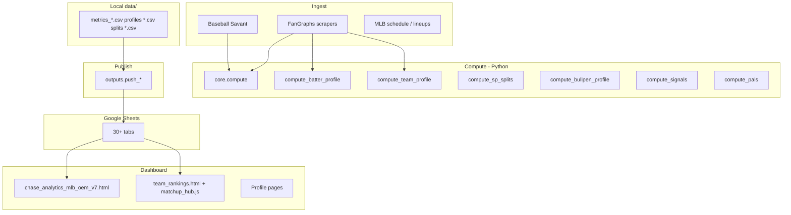

# MLBMA Pipeline — Ecosystem Map

**Purpose:** Single reference for how metrics are built, where they land, and how Team Rankings vs Research Lab consume them. Use this to compare **current state** vs your desired UX when the batter-splits scrape finishes.

**Last reviewed:** 2026-05-22  
**Sheet ID:** `1D28pC1lqMbsCcTBP67WhJPzYHn2UdtveMEv6RsUSczk`  
**Config SSOT:** `core/config.py` → `dashboard/mlbma_config.js` (generated)

---

## 1. Architecture (high level)



| Layer | Role |
|--------|------|
| **Raw stats** | K%, BB%, wOBA, xwOBA, Chase%, Barrel%, etc. from FanGraphs/Savant CSVs |
| **Component scores** | ABQ, RCV, OBR (0–100, min–max vs league or pool) |
| **Composite scores** | OSI, projOSI, OOR, PALS, PitchScore |
| **Derived / UI gaps** | PP-Gap, DF-Gap, F5 OSI, sus, tier labels |
| **Normalization (display)** | Python `normalize()` on teams; JS `registerLeaguePool` + z-score colors |

---

## 2. Metric catalog (formulas)

Weights live in **`core/config.py`** unless noted.

### 2.1 Offense stack

| Metric | Formula | Inputs (typical) |
|--------|---------|------------------|
| **ABQ** | `0.30×discipline + 0.35×contact + 0.20×pitch_pressure + 0.15×k_avoidance` | BB%, Chase% (or K% proxy), ZCon%, OCon%, SwStr% (or K% proxy) |
| **RCV** | `0.35×wRC+ + 0.32×Barrel% + 0.20×ISO + 0.13×HardHit%` | FanGraphs + Savant; park-adjusted barrel/ISO/HH |
| **OBR** | `0.65×xwOBA + 0.35×BB%` | FanGraphs standard + Savant xwOBA |
| **OSI** | `0.43×RCV + 0.37×ABQ + 0.20×OBR` | Components above |
| **projOSI** | `OSI + clip((xwOBA − wOBA) × 450, −8, +8)` | Same as OSI + regression signal |
| **reg_signal** | Same as `(xwOBA − wOBA) × 450` clipped | Exported on team CSVs |

**Code:** `core/compute_abq.py`, `compute_rcv.py`, `compute_obr.py`, `compute_osi.py`, orchestrated by `core/compute.py`.

### 2.2 Platoon / opponent

| Metric | Formula | Output |
|--------|---------|--------|
| **HvR / HvL** | OSI from `metrics_vs_RHP` / `metrics_vs_LHP` | Per-team split columns |
| **OOR** | `0.55×norm(HvR) + 0.45×norm(HvL)` | `metrics_oor.csv` → tab `OOR` |

### 2.3 Pitching

| Metric | Formula | Output |
|--------|---------|--------|
| **PitchScore** | `0.40×K% + 0.35×inv(BB%) + 0.25×inv(HR/9)` | `metrics_pitching_score.csv` → `Pitching_Score` |
| **Combined staff (UI only)** | `0.70×SP PitchScore + 0.30×bullpen` | OEM / profiles; bullpen from inverted OSI allowed |
| **OSI/ABQ/RCV/OBR allowed** | Mean opponent offense from game logs | SP/bullpen profiles, not recomputed from rate stats |

### 2.4 Lineup / context

| Metric | Formula | Output |
|--------|---------|--------|
| **PALS** | `0.50×norm(OSI) + 0.50×norm(avg_xFIP_faced, invert)` | `metrics_pals.csv` → `PALS` |
| **F5 OSI (proxy)** | `0.45×ABQ + 0.35×OBR + 0.20×RCV` | JS only (`F5_OSI_WEIGHTS` in config) |

### 2.5 Gaps & trends (naming warning)

| Name | Definition A (glossary, signals, Team Rankings hub) | Definition B (profiles / sheets) |
|------|---------------------------------------------------|--------------------------------|
| **PP-Gap** | `ABQ − RCV` (process vs production) | `projOSI − OSI` (= reg_signal) in `Batter_Profiles.PP_Gap`, `Team_Profiles.pp_gap` |
| **DF-Gap** | `RCV − OBR` (power floor) | Dashboard JS only |
| **sus** | Sustainability blend from reg + quality | OEM JS only; not in Sheets |

**Action for your spec:** Pick one PP-Gap meaning and align `Team_Profiles`, hub, and glossary.

### 2.6 Rolling windows (Team_Profiles)

| Column | Source file | Date range |
|--------|-------------|------------|
| `osi_l30`, `abq_l30`, … | `batter_splits_recent.csv` | Last 30 days (`BATTER_RECENT_DAYS`) |
| `osi_l14`, … | `batter_splits_l14.csv` | Last 14 days |
| `osi_l7`, … | `batter_splits_l7.csv` | Last 7 days |
| `osi_ytd` | Season offense row | Full season |
| `home_osi` / `away_osi` | Home/away split aggregation | Season |

Built in `core/compute_team_profile.window_trend()` → PA-weighted team metrics from batter pools. If L7/L14/recent CSVs are **empty**, `_blend_metric()` copies one value into all three windows (current Google Sheets issue).

---

## 3. Normalization

### 3.1 Python (`core/metrics_utils.py`)

| Function | Universe | Flat series |
|----------|----------|-------------|
| `normalize()` | ~30 teams per split | → **50** |
| `normalize_pool()` | Batters in one split CSV | → **0** |
| `invert()` | Same as normalize | flipped |

Team metrics (`core/compute.py`): **team league** per split.  
Batter metrics (`compute_batter_profile`): **within-split player pool** (scores not comparable across splits without re-pooling).

### 3.2 Dashboard (`dashboard/mlbma_assets.js`)

- `registerLeaguePool(context, values)` — runtime mean/std per table render
- `metricColor(value, context)` — z-score → 7-step red/green
- Contexts: `osi`, `abq`, `rcv`, `obr`, `pitching`, etc.
- `ppGapColor` / `dfGapColor` — sign thresholds, not z-score

**Implication:** Table colors reflect **current filtered row set**, not a fixed season baseline unless pools are seeded once at load.

---

## 4. Pipeline: scrape → CSV → Sheets

### 4.1 Core team offense (daily metrics)

| Step | Command / module | Output CSV | Sheet tab |
|------|------------------|------------|-----------|
| Savant | `scrapers.scrape_savant` | `savant_team_leaderboard.csv` | — |
| FanGraphs | `scrapers.scrape_fangraphs` | `vs_*_standard.csv`, batted ball, `sp_standard.csv` | — |
| Compute | `core.compute` | `metrics_vs_RHP.csv`, `metrics_vs_LHP.csv`, `metrics_oor.csv`, `metrics_pitching_score.csv` | `vs_RHP`, `vs_LHP`, `OOR`, `Pitching_Score` |
| Push | `outputs.push_sheets` | — | `Last_Updated` |

### 4.2 Profiles & research data

| Step | Module | Output | Sheet tab |
|------|--------|--------|-----------|
| Batter splits | `scrapers.scrape_batter_splits` | `batter_splits_*.csv` (8+ files) | Rate tabs: `Batter_Splits_*` |
| Batter compute | `core.compute_batter_profile` | `batter_profiles.csv` | `Batter_Profiles` |
| Team compute | `core.compute_team_profile` | `team_profiles.csv` | `Team_Profiles` |
| SP | `core.compute_sp_splits` + push | `sp_profiles.csv`, etc. | `SP_Profiles`, `SP_Metric_Splits`, … |
| Bullpen | `core.compute_bullpen_profile` + push | `bullpen_unit.csv`, … | `Bullpen_Unit`, … |
| PALS | `scrapers.scrape_pals` / `compute_pals` | `metrics_pals.csv` | `PALS` |
| Signals | `core.compute_signals` | `signals_*.csv` | `Signals_Today`, `Signals_Convergence` |
| Matchups | `scrapers.scrape_matchups` | `today_matchups.csv` | `Today_Matchups` |
| Lineups | `scrapers.scrape_lineups` | `today_lineups.csv` | `Today_Lineups` |

### 4.3 Orchestration

`python -m pipeline.main` — 19 steps; team profiles = steps 18–19 (compute + push only; **does not** scrape batter windows).

**Fix window columns in Sheets:**

```powershell
# If full scrape already ran but recent/l14/l7 were empty (~15 min):
python -m scrapers.scrape_batter_splits --windows-only

# Or full scrape (windows run first now):
python -m scrapers.scrape_batter_splits

python -m scripts.verify_window_data
python -m core.compute_team_profile
python -m outputs.push_team_profiles
```

Window splits use **lower min PA** (L7=8, L14=15, L30=25), explicit `splitArr=`, and **`startDate` / `endDate`** (not `start` / `end` — those are ignored by FanGraphs and return full-season stats).

---

## 5. Dashboard surfaces

### 5.1 Team Rankings (dedicated page)

| Item | Value |
|------|--------|
| **URL** | `dashboard/team_rankings.html` |
| **JS SSOT** | `dashboard/matchup_hub.js` (`HUB` state) |
| **Fetches** | `vs_RHP`, `vs_LHP`, `Team_Profiles` only |
| **Toggles** | Hand: Both / vs RHP / vs LHP / F5 · Window: YTD / L30 / L14 / L7 · Loc: All / Home / Away |
| **Filter order** | Hand base → window overlay (profiles) → location overlay (`home_osi` / `away_osi`) |
| **Does not load** | `research_lab.js`, OEM inline script, PALS tab (unless `LIVE_DATA` exists elsewhere) |

### 5.2 Research Lab (embedded in OEM)

| Item | Value |
|------|--------|
| **URL** | `chase_analytics_mlb_oem_v7.html#section-research-lab` |
| **Tabs** | Compare · Trends · Splits · Pitcher Intelligence · (legacy hidden panes) |
| **JS ownership** | Trends/Splits UI: **`rl_tab_uix.js`** · Compare/PVL: **`research_lab.js`** · Pitchers: **`pitcher_lab.js`** |
| **Global bar** | `STATE.split` / `STATE.time` (YTD/L30/L14/L7) synced partially to `SPLITS_STATE`; **not** to `TRENDS_STATE` |
| **Boot** | `loadLandingData()` then `loadResearchData()` → `LIVE_DATA` + globals `SCO_YTD_*`, `SCO_L30_B`, … |

### 5.3 Opening Dashboard / Matchups

| Surface | Module | Data |
|---------|--------|------|
| Hero matchups | `platform_dashboard.js` | `Today_Matchups`, lineups, weather |
| Signals strip | `mlbma_signals.js` | `Signals_Today` |
| Standings / map | `mlbma_standings.js`, market map | Various |

### 5.4 Profile pages

Read mostly from **`Team_Profiles`**, **`Batter_Profiles`**, **`SP_Profiles`**, **`Bullpen_*`** via `fetchSheetTab` or embedded logic in each HTML.

---

## 6. State machines (filters)

| Object | Location | Keys | Used by |
|--------|----------|------|---------|
| `HUB` | `matchup_hub.js` | `hand`, `window`, `location`, `sortKey`, … | Team Rankings only |
| `STATE` | OEM inline | `split`, `time`, `sortKey`, `compareTeams`, … | Research global bar, legacy leaderboard |
| `SPLITS_STATE` | `rl_tab_uix.js` | `lineupSplit`, `window`, `pitchEntity`, … | Splits tab |
| `TRENDS_STATE` | `rl_tab_uix.js` | `metric`, `location` | Trends tab (L30/L14/L7 columns fixed) |
| `ResearchLab` / `RL` | `research_lab.js` | compare sides, PVL team, … | Compare tab |

**No shared filter bus today** — Team Rankings and Research Lab do not read the same state object.

---

## 7. Google Sheets — tab ↔ metric quick reference

| Tab | Primary metrics / use |
|-----|---------------------|
| `vs_RHP` / `vs_LHP` | ABQ, RCV, OBR, OSI, projOSI, reg_signal, wRC+, wOBA, xwOBA, SLG |
| `Team_Profiles` | Full team card: YTD + **osi_l30/l14/l7**, home/away, platoon, pitching, bullpen, top batters JSON |
| `Batter_Profiles` | Per-player OSI stack, PP_Gap (proj−OSI), trend |
| `OOR` | OOR, HvR, HvL, ranks |
| `PALS` | PALS score |
| `Pitching_Score` | Team PitchScore |
| `SP_Profiles` / `SP_Metric_Splits` | Pitcher allowed metrics, FIP, splits |
| `Bullpen_Unit` | Unit ERA, OSI allowed tiers |
| `Today_Matchups` / `Today_Lineups` | Slate, SP hands, edges |
| `Signals_*` | Rule-based betting signals |

**Not pushed as separate tabs:** `batter_splits_l7.csv`, `l14.csv`, `recent.csv` (inputs to `Team_Profiles` only).

---

## 8. Known issues & errors (current environment)

| Issue | Impact | Fix |
|-------|--------|-----|
| Empty `batter_splits_l7/l14/recent.csv` | L30=L14=L7 in `Team_Profiles` | Run `scrape_batter_splits` |
| PP-Gap dual definition | Hub vs sheet disagree | Align column + UI |
| `savant_vs_RHP/LHP.csv` unused | Dead scrape cost | Remove scrape or wire into RCV |
| OEM inline duplicates `fetchSheetTab` / `scoreRowFromSheet` | Drift vs `matchup_shared.js` | Extract `oem_data.js` |
| Hidden `pane-leaderboards` still renders | Wasted CPU, confusion | Delete or expose as tab |
| Cache-bust version skew on `team_rankings.html` | Stale shared JS | Align `?v=` with OEM (see `mlbma_build.js`) |
| `normalize_pool` flat → 0 vs team flat → 50 | Batter vs team scale mismatch | Document or unify |
| Team headline `osi` in profiles | vs RHP only, not blend | Document in UI copy |

---

## 9. Redundancy map (what exists twice)

| Logic | Copies |
|-------|--------|
| ABQ/RCV/OBR/OSI scoring | `core/compute_*.py`, `compute_batter_profile`, OEM `scoreRows()`, `matchup_hub` enrich |
| `mergeBoth` / YTD blend | `matchup_hub.js`, `rl_tab_uix.js`, OEM inline |
| `parseTeamProfileRows` | OEM inline, `matchup_hub.js`, `research_lab.js` |
| PitchScore | `compute_pitching.py`, `matchup_shared.computePitchScoreFromRates`, profile HTML |
| Window rows L30/L14/L7 | `syncWindowScoresFromProfiles` (OEM), `matchup_hub` profile overlay, `rl_tab_uix` trends |
| Rankings table UI | Hidden OEM `renderMasterTable`, `team_rankings.html` hub table |

**Intentional no-op:** `outputs/push_matchups.py` (matchups pushed from scraper).

**Legacy redirect:** `matchup_sheet.html` → `team_rankings.html`.

---

## 10. Recommended updates (for your spec comparison)

### Google Sheets / pipeline

1. Populate window split CSVs; add CI check `scripts/verify_window_data.py`.
2. Rename or split `pp_gap` column: `pp_gap_process` (ABQ−RCV) vs `reg_gap` (proj−OSI).
3. Push `team_metric_history.csv` or document it as local-only.
4. Consider tab `Team_Windows` with raw L30/L14/L7 if you want to audit without opening CSVs.

### Formulas

5. Unify PP-Gap in `compute_team_profile._pp_gap()` with glossary.
6. Expose `sus` in pipeline if Research Lab should persist it.
7. F5 OSI: compute in Python for `Team_Profiles` column if hub/OEM should match.

### UIX / ecosystem

8. **Single filter model** across Team Rankings + Research Lab (hand, window, location, metric).
9. **Single fetch layer** — all pages use `matchup_shared.js` only.
10. **Extract OEM inline** (~3k lines) to `oem_dashboard.js`.
11. Remove hidden leaderboards pane or link “Team Rankings” nav as the one true 30-team table.
12. Sync `TRENDS_STATE` with global time window OR document independence.
13. One build token: `MLBMA_BUILD` in every script `?v=` query (extend `generate_mlbma_config_js.py`).

### When you write your “wants” doc

Compare against:

- **§2** metric definitions  
- **§5** surface boundaries (Team Rankings vs RL tabs)  
- **§6** filter state (what should stay in sync)  
- **§8** known bugs you care about fixing first  

---

## 11. File index (by role)

| Path | Role |
|------|------|
| `core/config.py` | Weights, sheet ID, tabs, thresholds |
| `core/compute.py` | Team offense CSVs |
| `core/compute_team_profile.py` | `team_profiles.csv` + windows |
| `core/compute_batter_profile.py` | `batter_profiles.csv` |
| `core/compute_signals.py` | Betting signals |
| `pipeline/main.py` | Full orchestration |
| `dashboard/mlbma_config.js` | Sheet tabs (generated) |
| `dashboard/matchup_shared.js` | Fetch, parse, `scoreRowFromSheet` |
| `dashboard/mlbma_assets.js` | Colors, logos, z-scores |
| `dashboard/matchup_hub.js` | Team Rankings |
| `dashboard/chase_analytics_mlb_oem_v7.html` | Platform shell + inline boot |
| `dashboard/research_lab.js` | RL compare / data bridge |
| `dashboard/rl_tab_uix.js` | Trends + Splits SSOT |
| `dashboard/pitcher_lab.js` | Pitcher Intelligence |
| `dashboard/platform_dashboard.js` | Matchups hero |
| `docs/AUDIT_BACKLOG.md` | Prioritized fix list |

---

*Generated for handoff while batter-splits scrape runs. Update this doc when you change `PROFILE_COLUMNS`, sheet tabs, or dashboard SSOT rules.*
