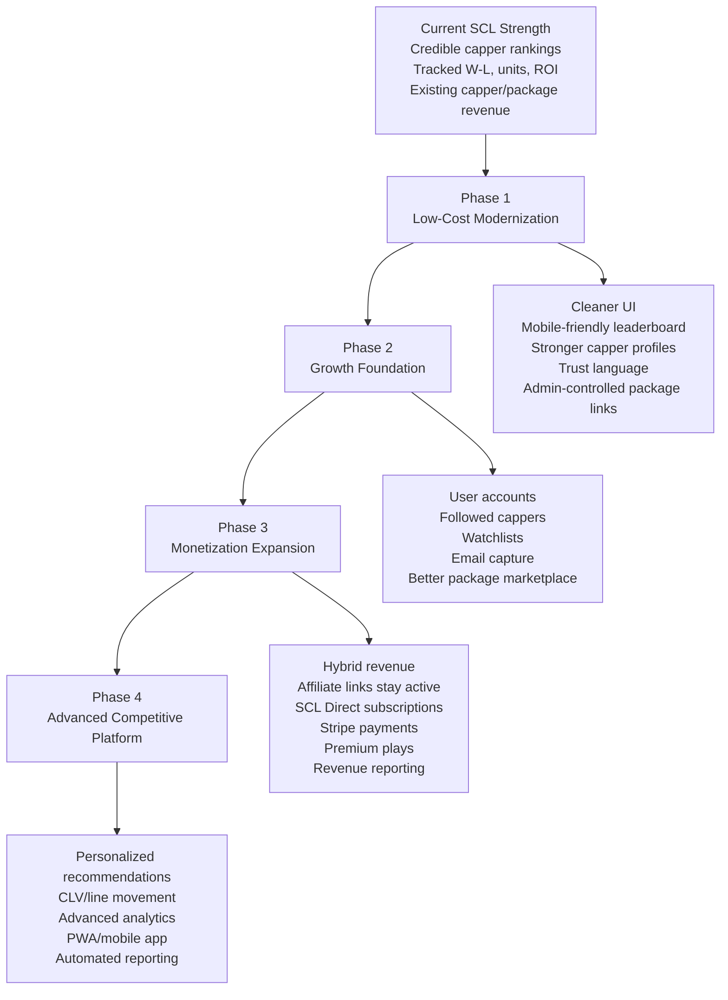
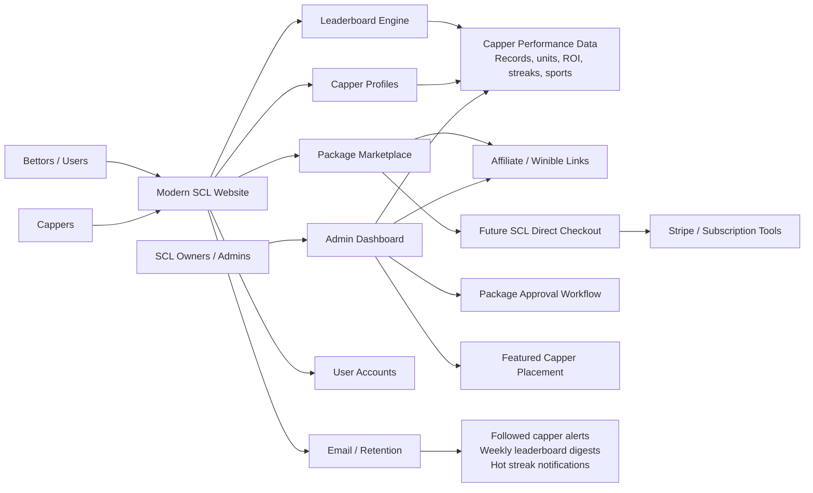
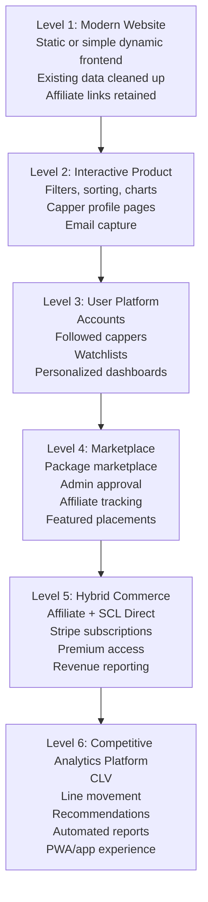
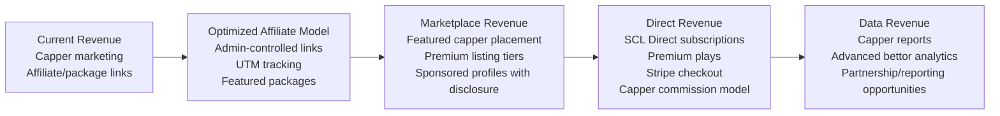
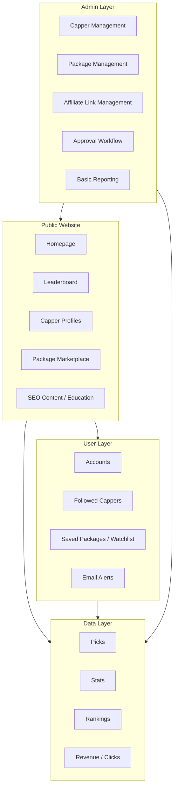
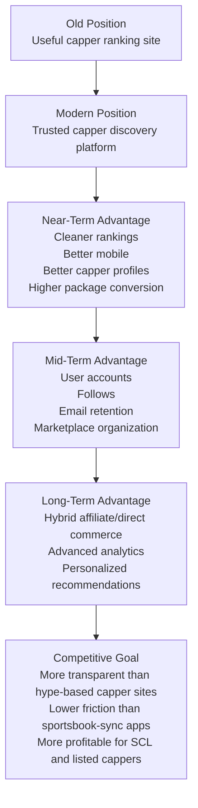

# Sports Cappers Leaderboard Visual Modernization Roadmap

## 1. Big Picture Strategy

## 2. Platform Component Map

## 3. Cost-Control Build Order

```mermaid
flowchart TD
    A["Build First<br/>High value, lower cost"] --> A1["Design refresh"]
    A --> A2["Responsive leaderboard"]
    A --> A3["Improved capper profiles"]
    A --> A4["Admin-managed package links"]
    A --> A5["Trust badges and ranking explanation"]

    B["Build Next<br/>Growth and retention"] --> B1["User accounts"]
    B --> B2["Follow/save cappers"]
    B --> B3["Email signup and weekly digest"]
    B --> B4["Better package marketplace"]
    B --> B5["Basic admin dashboard"]

    C["Build Later<br/>Only after validation"] --> C1["Direct SCL payments"]
    C --> C2["Premium plays"]
    C --> C3["Capper self-service dashboard"]
    C --> C4["Revenue reporting"]

    D["Delay<br/>Expensive or complex"] --> D1["Native mobile app"]
    D --> D2["Sportsbook sync"]
    D --> D3["AI picks"]
    D --> D4["Community forums"]
    D --> D5["Full CLV/line movement automation"]
```

## 4. Scalability Ladder

## 5. Revenue Model Evolution

## 6. Recommended Product Architecture

## 7. What SCL Should Become

